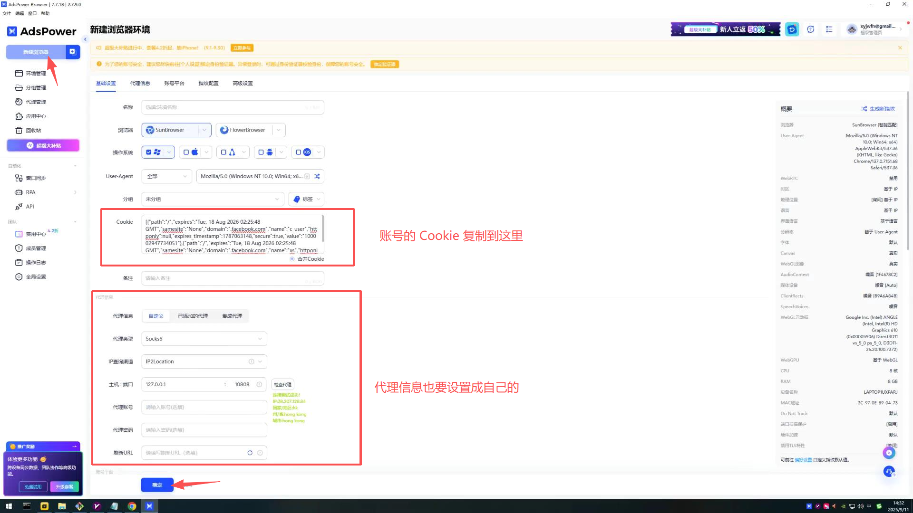

+++
title = 'AdsPower 指纹浏览器使用 Cookie 登录 Facebook'
description = 'AdsPower 浏览器使用 Cookie 登录 Facebook，可实现无账号密码一键登录 Facebook。'
date = 2025-09-11T13:33:00
draft = false
+++

### 安装 AdsPower

官网下载： [下载链接](https://www.adspower.net/download) 

**请根据自己的操作系统选择对应的版本**


### Cookie 的格式

在使用 Cookie 之前先说一下 Cookie 两种格式：

1. JSON 格式

```JSON
[{
	"name": "c_user",
	"value": "61577773708449",
	"expires": "Wed, 24 Jun 2026 04:36:51 GMT",
	"expires_timestamp": 1782275811,
	"domain": ".facebook.com",
	"path": "/",
	"secure": true,
	"httponly": null,
	"samesite": "None"
}, {
	"name": "xs",
	"value": "xxx",
	"expires": "Wed, 24 Jun 2026 04:36:51 GMT",
	"expires_timestamp": 1782275811,
	"domain": ".facebook.com",
	"path": "/",
	"secure": true,
	"httponly": true,
	"samesite": "None"
}]
```
2. URL 格式

```txt
c_user=61577773708449; xs=xxx
```

以上两种格式，`AdsPower` 都支持。

 
### 创建窗口

1. 打开 **AdsPower** 后点击左上角的**新建浏览器**
2. 然后将账号的 Cookie 粘贴到 Cookie 输入框中
3. 设置好信息后，点击 **保存** 按钮



 ### 启动窗口

1. 点击**环境管理**
2. 找到新创建好的窗口，点击**打开** 
3. 等待窗口启动完成就可以使用 Facebook 了

 


