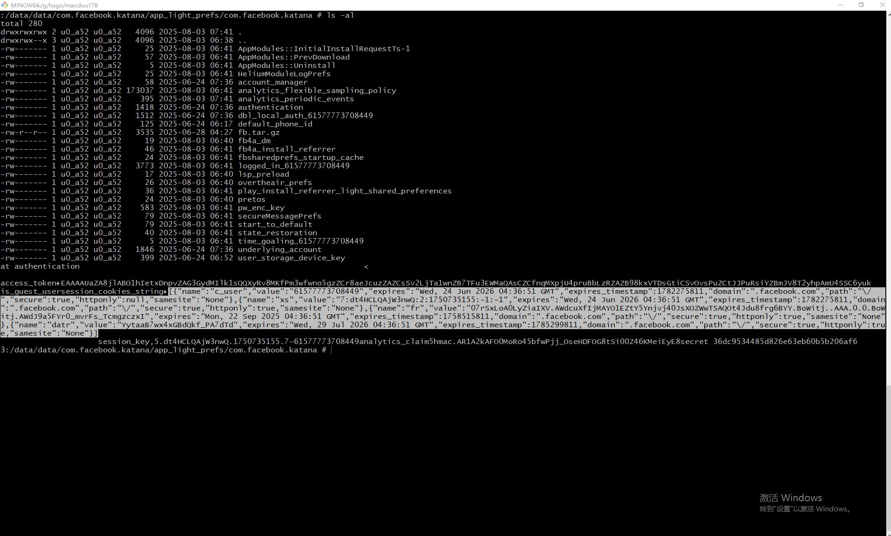

+++
title = 'Facebook App 提取用户认证 Cookie'
description = 'Facebook、脸书 Android App 提取用户Cookie'
date = 2025-08-03 11:24:00+08:00
draft = false
+++



### 前提条件

1. 一台已经Root的 Android 手机
2. 登录需要提取 Cookie 的 Facebook 账号

我使用的是雷电的模拟器，大家也可以使用雷电模拟器，就不需要再去Root了。

**因为是模拟器，小心被封号**


### Facebook Cookie 介绍

开始实操之前，我先讲一下两个关于 Facebook 的认证 Cookie，它们分别是：

1. `xs`: 可以理解为 session id、令牌
2. `c_user`： Facebook 的用户id

我们要提取的主要就是这两个Cookie，其他的杂七杂八的Cookie可以忽略，用不上。

> 关于Cookie的使用这里就不多介绍了，以后会再出一些教程来演示使用，包括Chrome、指纹浏览器的使用。


### Cookie 文件

Facebook App登录成功后会生成一个`authentication`文件，这个文件可以在 `/data/data/com.facebook.katana/app_light_prefs/com.facebook.katana`
目录下找到。

`authentication` 是一个按一定规律生成的配置文件直接打开是乱码需要写程序解析，下面是我解析过后里面包含以下内容：

```
{
	"access_token": "认证令牌",
	"uid": "61577773708449",
	"is_guest_user": false,
	"session_cookies_string": "本文需要提取的cookie字段",
	"session_key": "这个有用后面再解释",
	"analytics_claim": "hmac.xxx",
	"secret": "36dc9534485d8xxxxx"
}
```

其中的`session_cookies_string`字段就是我们需要的 Cookie。 虽然`authentication`文件是乱码的，但是还是可以直接通过
正则表达式匹配里面的 Cookie。

下面是我通过`cat`命令拿到乱码文件的内容：



虽然有点乱码，但还是能够识别出 Cookie 字符串。可以通过`\[.*?\]`来匹配 Cookie 字符串。


### 买个关子

还有一种情况是`authentication`文件中的`sessi on_cookies_string`字段是空的，并没有我们想要的 Cookie 字符串，这种情况
一般是出现在找回账号的后。

虽然它没有直接生成 Cookie 字符串，但还是有方法可以得到 Cookie，这个以后我再单独出个文章讲讲如何通过其他的内容生成用户的
认证 Cookie 然后直接通过浏览器登录。

 

